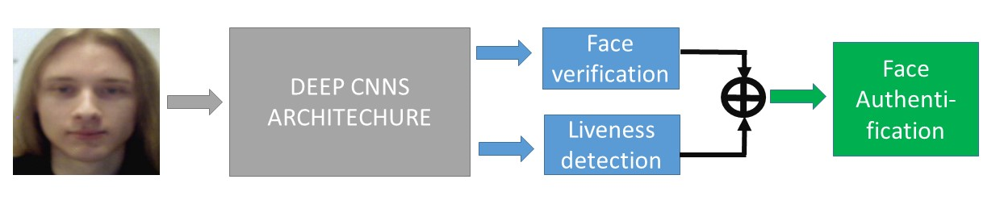

# Demo of the FaceLiveNet1.0 for face verification and facial expression recogntion
This is the implementation of the paper [FaceLiveNet: End-to-End Networks Combining Face Verification with Interactive Facial Expression-Based Liveness Detection](https://ieeexplore.ieee.org/abstract/document/8545274) published on the ICPR 2018 for the face authentication, which employs the face verification and the liveness control simultaneous. The demo is realized in TensorFlow1.13, Python 2.7 and openCV 3.0 under Unbuntu 16.4. 

The accuracy of the face verification are measured on the benchmark LFW (99.4%) and YTF(95%), the accuracy of the facial expression recognition of the six basic expressions is measured on the benchmark CK+(99.1%), OuluCasia(87.5%), SFEW(53.2%) and FER2013(68.6%). Fusing the face verification and the facial expression recognition, the global accuracy of the face authentication on the proposed dataset based on the CK+ and the OuluCasia is 99% and 92% respectively. The proposed architecture is shown in . 

## Dependencies
- The code is tested on Ubuntu 16/18.

- install Tensorflow pip install tensorflow-gpu==1.13.1 (for GPU)

- install opencv 2.4.13: pip install OPENCV-PYTHON

- install python 2.7

- install the package of the python : pip install scipy Pillow matplotlib sklearn h5py numpy matplotlib sklearn

- install tk package: apt-get install python-tk

## Protocol for the face authentication
The face authentication including the face verification and the liveness control can employ in two modes: real-time mode and off-line mode. For the liveness control, both two modes are based on the facial expression Challenge-Response mechanism, i.e. the system randomly proposes an expression as a request, if the user can give a right response by acting the right expression and verified by the system, the user can pass the liveness control. Specially, in this demo maximum two expressions (Happy/Surprise) can be used as the request in the liveness control. Beside the required expression, the neutral expression is always detected in both of the two modes. Since people normally start from the neutral expression to act a facial expression. In this way, the system can protect from the attack of the photo with a facial expression.

### 1. Real-time face authentication 
In the real-time face authentication mode, the face authentication will employ on the real-time camera video stream, the system will not unlock until the user gives the right response and verified by the system. 

### 2. Off-line face authentication based on the upload video
In the off-line face authentication mode, the face authentication is based on the use's upload video-clips. One expression is corresponding to one video. The user will take a video-clip of her/his facial expression and upload to the backend for the face authentication.  This mode is risk to take an inappropriate or incomplete video-clip, however the system only processes a small video-clip rather than the video stream in the real-time mode.
 
## Download the Pretrained model
# model updates:
| model | date | comment |
|:-------|:-------|:-------|
| [20180115-025629](https://drive.google.com/file/d/1B-ZRtWk1UoAQXHTewhKV5UPvwP3L102X/view?usp=sharing) | 2018.01.15 | FaceLiveNet: face verification and facial expression recognition |


## Training
The face verification networks is trained on the [CASIA-WebFace](http://www.cbsr.ia.ac.cn/english/CASIA-WebFace-Database.html), [MSCeleb](https://www.msceleb.org/), the facial expression recognition networks branch is trained on the  [CK+](http://www.consortium.ri.cmu.edu/ckagree/), [OuluCasia](http://www.cse.oulu.fi/CMV/Downloads/Oulu-CASIA), [SFEW](https://computervisiononline.com/dataset/1105138659) and [FER2013](https://www.kaggle.com/c/challenges-in-representation-learning-facial-expression-recognition-challenge/data). 


## Face alignment
The face detection is implemented by the [Multi-task CNN (Joint Face Detection and Alignment using Multi-task Cascaded Convolutional Networks).The paper for MTCNN)](https://kpzhang93.github.io/MTCNN_face_detection_alignment/index.html).


## Parameters and Example
### Parameters:

--model_dir: Directory containing the metagraph (.meta) file and the checkpoint (ckpt) file containing model parameters;  
--image_ref: The reference image for the face verification;  
--num_expression: The number of the required expressions for face authentication. The maximum num_request_expression is 2 which are the Happy and Surprise, otherwise the Happy will be chosen for face authentication	;  

### Examples for command line:
### Predict
1. Real-time mode (Computing on CPU by default):
```shell
python test_realtime.py --model_dir ../models/20180115-025629_model/best_model/ --img_ref ../data/images/
```

2. Real-time mode (Computing on GPU):
```shell
python test_realtime.py --model_dir ../models/20180115-025629_model/best_model/ --img_ref ../data/images/ --device GPU
```
<!---
3. Real-time mode (only predict the face verification/CPU):
python test_realtime_verif.py --img_ref ../data/images/indoor --model_dir /mnt/hgfs/share/models/20170131-234652 --video /mnt/hgfs/share/data/face_recog/videoclips/WIN_20190627_16_06_54_Pro.mp4
-->

### Training for facial expression reocognition
1. cd /FaceLiveNet/src:  
```shell
python train_expression.py --logs_base_dir /data/zming/logs/expression --models_base_dir /data/zming/models/expression --data_dir /data/zming/datasets/Oulu-Casia/VL_Strong_mtcnnpy_182_160 --labels_expression /data/zming/datasets/Oulu-Casia/Emotion_labels_VIS_Strong_Six.txt --image_size 160 --model_def ./models/inception_resnet_v1_expression_simple.py --optimizer RMSProp --learning_rate -1 --max_nrof_epochs 10000 --keep_probability 0.5 --learning_rate_schedule_file ../data/learning_rate_schedule_classifier_oulucasia.txt --weight_decay 5e-5 --center_loss_factor 1e-1 --center_loss_alfa 0.5 --gpu_memory_fraction 0.7 --epoch_size 100 --batch_size 90 --pretrained_model /data/zming/models/expression/20180113-231253/best_model --lfw_dir /data/zming/datasets/lfw/lfw_mtcnnpy_160 --nfold 10 --ifold 4 --learning_rate_decay_epochs 5 --expr_pairs ../data/IdentitySplit_4th_10fold_oulucasiapairs_Six.txt --learning_rate 1e-4
```

### Training for face reocognition
1. cd /FaceLiveNet/src:  
```shell
python train_verification.py --logs_base_dir /data/zming/logs/expression --models_base_dir /data/zming/models/expression --data_dir /data/zming/datasets/Oulu-Casia/VL_Strong_mtcnnpy_182_160 --labels_expression /data/zming/datasets/Oulu-Casia/Emotion_labels_VIS_Strong_Six.txt --image_size 160 --model_def ./models/inception_resnet_v1_expression_simple.py --optimizer RMSProp --learning_rate -1 --max_nrof_epochs 10000 --keep_probability 0.5 --learning_rate_schedule_file ../data/learning_rate_schedule_classifier_oulucasia.txt --weight_decay 5e-5 --center_loss_factor 1e-1 --center_loss_alfa 0.5 --gpu_memory_fraction 0.7 --epoch_size 100 --batch_size 90 --pretrained_model /data/zming/models/expression/20180113-231253/best_model --lfw_dir /data/zming/datasets/lfw/lfw_mtcnnpy_160 --nfold 10 --ifold 4 --learning_rate_decay_epochs 5 --expr_pairs ../data/IdentitySplit_4th_10fold_oulucasiapairs_Six.txt --learning_rate 1e-4
```

### Citation
    @inproceedings{ming2018facelivenet,
      title={FaceLiveNet: End-to-end networks combining face verification with interactive facial expression-based liveness detection},
      author={Ming, Zuheng and Chazalon, Joseph and Luqman, Muhammad Muzzamil and Visani, Muriel and Burie, Jean-Christophe},
      booktitle={2018 24th International Conference on Pattern Recognition (ICPR)},
      pages={3507--3512},
      year={2018},
      organization={IEEE}
    }

### License
This code is distributed under MIT LICENSE

### Contact
Zuheng Ming
zuheng.ming@univ-lr.fr
